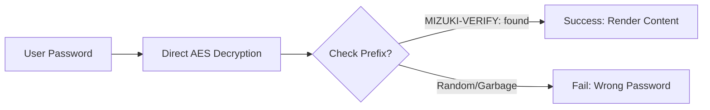

本博客模板基于 [Astro](https://astro.build/) 构建。本指南中未涉及的内容，你可以在 [Astro 文档](https://docs.astro.build/) 中找到答案。

## 文章的 Front-matter

```yaml
---
title: My First Blog Post
published: 2023-09-09
description: This is the first post of my new Astro blog.
image: ./cover.jpg
tags: [Foo, Bar]
category: Front-end
draft: false
---
```


| 属性          | 说明                                                                                                                                                                                                 |
|---------------|-------------------------------------------------------------------------------------------------------------------------------------------------------------------------------------------------------------|
| `title`       | 文章标题                                                                                                                                                                                      |
| `published`   | 文章发布日期                                                                                                                                                                            |
| `pinned`      | 是否将文章置顶于文章列表顶部                                                                                                                                                   |
| `description` | 文章的简短描述，显示在索引页面上                                                                                                                                                   |
| `image`       | 文章封面图片路径。<br/>1. 以 `http://` 或 `https://` 开头：使用网络图片<br/>2. 以 `/` 开头：使用 `public` 目录下的图片<br/>3. 无前缀：相对于 markdown 文件的路径 |
| `tags`        | 文章标签                                                                                                                                                                                       |
| `category`    | 文章分类                                                                                                                                                                                   |
| `alias`       | 文章别名。文章将通过 `/posts/{alias}/` 访问。示例：`my-special-article`（可通过 `/posts/my-special-article/` 访问）                                   |
| `licenseName` | 文章内容的许可证名称                                                                                                                                                                      |
| `author`      | 文章作者                                                                                                                                                                                     |
| `sourceLink`  | 文章内容的来源链接或参考文献                                                                                                                                                          |
| `draft`       | 文章是否为草稿状态，草稿文章不会显示                                                                                                                                                    |
| `encrypted`   | 文章是否受密码保护                                                                                                                                                                    |
| `password`    | 解锁加密文章的密码                                                                                                                                                                  |
| `passwordHint`| 帮助用户回忆密码的提示信息，显示在密码输入框下方                                                                                                                             |
| `hideHomeContent` | 是否隐藏公开的文章摘要，包括首页、meta 标签、Feed/API 摘要和分享预览。当设置了 `password` 时默认为 `true`                                      |

## 文章文件的存放位置


文章文件应放置在 `src/content/posts/` 目录下。你也可以创建子目录来更好地组织文章和资源文件。

```
src/content/posts/
├── post-1.md
└── post-2/
    ├── cover.png
    └── index.md
```

## 文章别名

你可以通过在 front-matter 中添加 `alias` 字段为任何文章设置别名：

```yaml
---
title: My Special Article
published: 2024-01-15
alias: "my-special-article"
tags: ["Example"]
category: "Technology"
---
```

设置别名后：
- 文章可通过自定义 URL 访问（例如 `/posts/my-special-article/`）
- 默认的 `/posts/{slug}/` URL 仍然可用
- RSS/Atom 订阅源将使用自定义别名
- 所有内部链接将自动使用自定义别名

**重要说明：**
- 别名不应包含 `/posts/` 前缀（系统会自动添加）
- 别名中避免使用特殊字符和空格
- 为获得最佳 SEO 效果，建议使用小写字母和连字符
- 确保所有文章的别名唯一
- 不要包含前导或尾部斜杠


## 工作原理



## 页面加密

你可以通过在 front-matter 中设置 `encrypted: true` 并提供 `password` 来为任何文章添加密码保护：

```yaml
---
title: My Private Post
published: 2024-01-15
encrypted: true
password: "my-secret-password"
passwordHint: "Hint: The password is my dog's name"
hideHomeContent: true
---
```

### 字段说明

| 字段           | 是否必填 | 说明                                                       |
|----------------|----------|----------------------------------------------------------|
| `encrypted`    | 是       | 设为 `true` 以启用密码保护                                      |
| `password`     | 是       | 解锁文章所需的密码                                            |
| `passwordHint` | 否       | 显示在密码输入框下方的提示信息，帮助用户回忆密码                      |
| `hideHomeContent` | 否   | 将公开摘要隐藏为"该文章已加密"。当设置了 `password` 时默认为 `true`。设为 `false` 可显示正常摘要。 |

### 解锁框的外观

解锁框会显示：
- 一个主题主色调的锁形图标
- 文章标题"密码保护"
- 一段提示输入密码的描述
- 密码提示信息（如果设置了 `passwordHint`）
- 密码输入框和解锁按钮

输入正确密码后，文章内容将被解密并显示。密码会存储在 session storage 中，因此用户在同一会话内的后续页面加载时无需重新输入。
