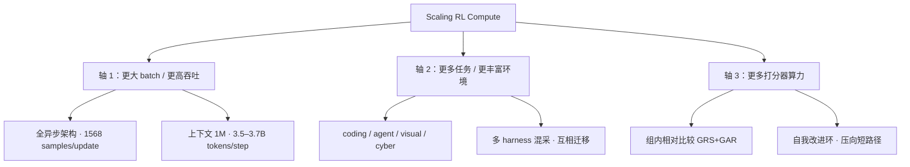

2026 年 9 月 22 日，MiMo-V2.6 系列公开。主线很明确：

**Scaling Reinforcement Learning Toward Self-Improvement.**

官方将其描述为走向 RSI（Recursive Self-Improvement）的关键一步：**在可验证的复杂任务上放大 RL 算力，让模型通过探索和反馈持续扩展能力边界。**

这次的重心是 RL 管线，而非 SFT 堆叠或扩大 dense 规模。本文基于公开材料，梳理架构参数、RL 训练管线、官方跑分，并给出独立解读。

资料来源：[官方发布正文](https://mimo.xiaomi.com/mimo-v2-6/article.html)、[HuggingFace 模型卡](https://huggingface.co/XiaomiMiMo/MiMo-V2.6-Pro-RL)、[技术报告 PDF](https://huggingface.co/XiaomiMiMo/MiMo-V2.6-Pro-RL/blob/main/MiMo_V2_6_technical_report.pdf)、[MOPD 论文](https://arxiv.org/abs/2606.30406)、[RL 训练直播](https://mimo.xiaomi.com/rl)。标注「官方」的数字均来自上述公开材料。

## 家族成员与硬指标

| | MiMo-V2.6-Pro | MiMo-V2.6-Flash | MiMo-V2.6-Pro-UltraSpeed | MiMo-V2.6-Distill-Qwen-9B |
|---|---|---|---|---|
| 定位 | 旗舰 | 效率均衡 | 极速输出 | 开源研究起点 |
| 架构 | Sparse MoE | Sparse MoE | Pro 的加速模式 | Dense（Qwen3.5-9B 蒸馏） |
| 总参数 / 激活 | **1.02T / 42B** | **309B / 15B** | 同 Pro | **9B** |
| HF 权重名 | Pro-RL | Flash-RL | — | Distill-Qwen-9B |
| 上下文 | **1M tokens** | **1M tokens** | 同 Pro | — |
| 模态 | 文/图/视频/音频 | 文/图/视频/音频 | 同 Pro | 图 + 文 |
| 输出速度 | 基准 | 基准 | **最高 20× Pro** | — |
| License | MIT | MIT | — | MIT |

**Artificial Analysis Intelligence Index：Pro 拿下 46.32**（v4.3，2026-09），官方称超过 Kimi K3 与 Qwen3.8 Max，**是目前最强开源模型**。同一价格带里智能更高，帕累托前沿又往外推了一格。

> [!NOTE]
> 「1.02T / 42B」是模型卡架构段的写法（总参数 / 每次激活）。HuggingFace 元数据标的 524B / 159B 是另一套统计口径（大约是一半），两处都是官方数据，别对不上就以为假。日常说「多少 B」时建议报激活参数，部署估显存时再对文件。
>
> 发布稿称 **Pro / Flash**，HF 权重文件名为 **Pro-RL / Flash-RL**，后者强调 RL 后训练形态。同一系列的不同命名。

一句话分工：**Pro 拿能力上限，Flash 拿性价比，UltraSpeed 给要实时反馈的场景，Distill-Qwen-9B 给想自己跑 agentic RL 的人一个便宜的学生。**

## 架构参数：和 V2.5 比，变了什么

### LLM Backbone

| 组件 | Pro-RL | Flash-RL |
|---|---|---|
| 层数（总 / SWA / GA） | 70 / 60 / 10 | 48 / 39 / 9 |
| Hidden Size | 6144 | 4096 |
| SWA Heads（Q/KV） | 128 / 8 | 64 / 8 |
| GA Heads（Q/KV） | 128 / 8 | 64 / 4 |
| Head Dim（QK / V） | 192 / 128 | 192 / 128 |
| 滑动窗口 | 128 | 128 |
| Routed Experts（总 / 激活） | 384 / 8 | 256 / 8 |
| 最大上下文 | 1M | 1M |
| MTP 草稿层 | 5 层 SWA，window 1024 | 同左 |

结构上有几个点需要留意。

1. **Hybrid SWA + GA**。第一层是 global attention + dense FFN，后面 local SWA 和 global attention 交错，两边都是 sparse MoE FFN，**没有 shared expert**。1M 上下文不是靠「全注意力硬扛」，是靠 SWA 把大部分层的注意力锁在 128 窗口里，再用少量 GA 层保住长程。
2. **MoE 不带 shared expert**。384/256 个 routed expert 里每次只动 8 个。没有 shared expert 意味着路由更「纯粹」，但对路由稳定性要求更高，这和后面要讲的 MoE RL 路由对齐论文是对上的。
3. **MTP 投机解码**。5 层 SWA 草稿器，DFlash 风格，一次前向猜 7 个后续 token，并行验证。推理侧是实打实的吞吐红利。

### 多模态编码器（Pro / Flash 共用）

| 编码器 | 配置 | 参数 |
|---|---|---|
| MiMo ViT | 28 层（24 SWA + 4 Full），hidden 1280，patch 2×16×16，spatial merge 2×2 | **681M** |
| AudioTokenizer | 24 层（12 SWA / 12 GA），hidden 1024，20 个 RVQ codebook | **308M** |
| Audio patch encoder | 6 层，4 帧一 patch（25 Hz → 6.25 Hz） | **127M** |

原生全模态进同一套 backbone，并非文本模型外挂视觉适配器。视频靠 ViT 的时间维 patch（T=2），音频走 tokenizer + patch encoder 双路。

## RL 训练管线

这是 V2.6 的核心更新。官方给出五条主线与若干工程细节，本节逐项拆解。

### 0. 先看规模：直播训练账单

这回 RL 是**全程直播**跑的（[mimo.xiaomi.com/rl](https://mimo.xiaomi.com/rl)），数字如下。

| | Flash | Pro |
|---|---|---|
| 训练时长 | **不到 6 天** | 同期 |
| RL 步数 | 30 | 30 |
| 轨迹数 | 约 **750k** | 约 **750k** |
| 成本 | 约 **$0.85M** | 约 **$2.62M** |
| 训练任务平均通过率 | 相对 **+25%** | 相对 **+12%** |
| DeepSWE v1.1（未见集） | 48.8 → **65.68**（+16.9） | 58.4 → **72.57**（+14.2） |

官方结论：RL 样本效率高、全程持续提升、**能泛化到训练分布之外**。

> [!TIP]
> **口径说明（审计用）**：发布稿写「1,568 samples per update」，模型卡写「1,568 prompts × 16 rollouts per step」。用总轨迹数反推：750k ÷ 30 步 ≈ **25,000 条轨迹/步**，正好等于 1568×16 ≈ 25,088。所以 samples ≈ prompts，rollout 另算。两套说法都出自官方，对得上。

### 1. You Only RL Once

> 官方表述：One mixed RL run across coding, general agents, visual, and cybersecurity — not separate per-domain runs.

此前各领域分别训练再合并的做法（Mix-RL / Cascade RL / Off-Policy SFT / 参数合并）都存在跷跷板效应或稳定性问题，A 领域涨、B 领域塌。

V2.6 的做法是：**一次混合 RL，跨 coding / general agent / visual / cybersecurity**。任务和多种 harness 混在同一个 batch 里，让能力互相喂，策略还能迁移到训练里从没见过的 harness 上。

这直接对上 MOPD 论文里批评的四条老路：

| 路线 | 问题 |
|---|---|
| Mix-RL | 跨域信号打架，见跷跷板 |
| Cascade RL | 先训的能力被后训的冲掉 |
| Off-Policy Finetune | 暴露偏置，学生漂离教师轨迹 |
| Param-Merge | 权重空间融合不稳，能力对不齐 |

而 V2.6 在混合 RL 之后还接了 **MOPD2**（见下文），等于「先一起练，再精确合」。

官方还补了一句工程要求：**稳定混合 batch 里各任务的采样比例**（stabilized per-task sampling ratios within mixed batches）。混采不是把数据倒一锅搅，比例不稳就会偏科。

### 2. Scaling RL Compute：三根轴

官方给出了三根扩展轴，构成理解 V2.6 RL 设计的骨架。

#### 轴 1：异步 GRPO + 超大 batch

> 模型卡：Fully asynchronous Group Relative Policy Optimization (GRPO) on very large batches — **1,568 prompts × 16 rollouts per step**。
>
> 发布稿：1,568 samples per update，training at up to **1M** context，**3.5–3.7B tokens per step**。

异步 GRPO 的含义可以拆成三点。

1. **Rollout 生成和梯度更新流水线化**。采样器不停地跑轨迹，训练器不停地吃完成的轨迹，不必等一整批 roll 完再算一次梯度。
2. **GRPO 的组相对优势**照旧：同一 prompt 下多条 rollout 互相比，advantage 是组内标准化的，不需要单独训 value 网络。
3. **单步 25,088 条轨迹**（1568×16），更新一次吃掉 3.5–3.7B token。这是把预训练级的算力账单搬到 RL 阶段。

核心判断：**RL 算力本身就是能力来源。** 「探索算力」与「打分算力」同步放大，数据多样性只是其中一面。

#### 轴 2：多任务、多环境、多 harness

做法是把 coding / general agent / visual / cyber **混在同一个 batch**，而且跨多种 agent harness。策略因此能迁移到「训练里从没见过的 harness」（模型卡原话）。

配套工程（发布稿原文拆解）：

| 设计 | 解决什么 |
|---|---|
| **统一轨迹表示 + 惩罚机制** | 异构任务的轨迹格式不一，统一后才能给更细粒度的学习信号 |
| **多 Agent 框架高并发交互** | 环境跑得动，rollout 吞吐才上得去 |
| **控制面 / 数据面解耦** | 大规模轨迹迁移不拖垮训练循环 |
| **稳定各任务采样比例** | 防止混采偏科 |
| **训练引擎与推理引擎一致性优化** | train/infer 不一致会白训 |

#### 轴 3：打分器也算力

这是整套设计里最关键的一环，下一节单独展开。

### 3. Groupwise Agentic Grading：自我改进环

问题：二值 pass/fail **排不出两个都过了的答案谁更好**。奖励信号太粗，RL 就只能推「从错到对」，推不动「从对到更好」。长程 agent 任务尤其惨，一条几万 token 的轨迹，最后只拿一个 0/1。

官方解法：**打分器自己也上 Agent，在组内比 rollout。**

| 组件 | 全称 | 何时 | 干什么 |
|---|---|---|---|
| **GRS** | Groupwise Reward Synthesis | **离线** | 从对比 rollout 里合成**任务专属 rubric**，再把 rubric 质量和测试结果融合 |
| **GAR** | Groupwise Advantage Redistribution | **在线** | 给**已经通过**的轨迹排序，把 advantage 往更高质量的解上搬 |

具体差异如下。

1. **GRS 解决「没有评分表」**：同一道题的多条 rollout 互相对比（哪里更好、哪里更简、哪里更稳），离线合成一份 rubric。相当于给这道题现场出评分细则，而不只看单元测试过没过。
2. **GAR 解决「都过了分不出高下」**：在线把通过的轨迹按质量排序，advantage 不再人人平分，而偏向更短路径、更少 token、更干净的解。
3. **闭环**：裁判看的是**策略自己的样本**。策略变强 → 样本变好 → rubric/排序更严 → 策略被推向更优解。这就是官方说的 *closes a self-improvement loop*。

副作用（好的那种）：会自动压向**更短路径、更少 token** 完成同一任务。

> [!TIP]
> 读这块时别把 GRS/GAR 理解成单纯的 reward model 变大。核心是 **组内相对比较** + **把粗奖励变稠密**，这是在 scaling **grader compute**，不是在 scaling 模型体积。

### 4. Aligned RL：自我纠错与反奖励劫持

RL 圈的老毛病：一旦奖励可被钻空子，策略会变成「骗过打分器」，偏离「把事做好」。

V2.6 的态度是双管齐下：

**冷启动用 self-correction**，模型反思并重写自己的不当轮次，改成有依据的下一步。第一轮就建立「认错→修正」的肌肉记忆。

官方配了四道锁（发布稿原话拆解）。

| 防线 | 作用 |
|---|---|
| **奖励设计** | 从源头减少可钻的空子 |
| **对抗评测** | 主动构造想骗奖励的案例去打 |
| **异常检测** | 训练中盯分布突变、reward 爆炸 |
| **verifier 交叉验证** | 不同裁判互相核对，单点被攻破不算数 |

另外，**训练规模上来后冻结了 MoE router**，抑制训练漂移（*we froze the router to suppress training drift*）。MoE 路由在 RL 里漂移是老大难，激活分布一变，下游全乱。冻住是务实解，代价是牺牲一点路由自适应。

### 5. MOPD2：Multi-Prefix Multi-Teacher On-Policy Distillation

MOPD 一代（[arXiv:2606.30406](https://arxiv.org/abs/2606.30406)）已经在 MiMo-V2-Flash 上落地过。核心思想：

1. 各领域先独立 RL 出 **domain teacher**（可完全并行）；
2. 学生自己 rollout，教师只负责在学生轨迹上给 **per-token 概率分布**（dense 信号）；
3. 按 prompt 路由到对应教师，policy space 融合，不碰权重平均。

一代在 Qwen3-30B-A3B 上归一化得分 **0.937**，比 Mix-RL（0.882）高 5.5 个点；在 309B 的 MiMo-V2-Flash 上多数基准打平甚至超过对应教师。

V2.6 的 **MOPD2** 多了 **Multi-Prefix**：

> 官方表述：combines autonomous student rollouts with prefix-conditioned single-turn rollouts (**Teacher-Prefix** and **SFT-Prefix**), reusing histories from teacher trajectories and SFT demonstrations so decision points train without regenerating preceding turns.

三种前缀的来源并不相同。

| 前缀来源 | 轨迹从哪来 | 训练什么 |
|---|---|---|
| **自主 rollout** | 学生从头采 | 完整决策链 |
| **Teacher-Prefix** | 教师轨迹的历史当输入 | 只训决策点之后 |
| **SFT-Prefix** | SFT 示范的历史当输入 | 只训决策点之后 |

好处：学生不必从头生成完整轨迹即可学习决策点。**借前缀跳过已掌握的部分**，难以自动验证的长任务也能被蒸馏覆盖。

MOPD 论文中另有一个值得注意的对照实验：**替换为更强但分布不同的教师（Qwen3-235B-A22B）后，学生数学能力反而下降**，top-k 形式甚至在第 18 步发散。同源教师（same-origin）是稳定性上的必要条件。

### 6. 全开源

官方承诺把这条管线上的一切放出来：**完整技术报告、训练环境、RL 代码**，供复现验证。配合直播回放，这在「开源权重但闭源 RL 配方」成风的当下，算相当大方。

综合来看：**RL 算力本身就是能力来源。** 预训练 scaling law 已被广泛验证，V2.6 将同样的逻辑迁移到 RL 阶段，训练成本公开也提升了工程透明度。

## 官方跑分

基准表直接来自模型卡。对手列同为官方对照，此处不作二次加工。

| 类别 | Benchmark | V2.6 Pro | V2.6 Flash | V2.5 Pro | Claude Opus 5 | GPT-5.6 Sol | Claude Fable 5 |
|---|---|---|---|---|---|---|---|
| **Code Agent** | DeepSWE v1.1 | **71.9** | 67.9 | 19.0 | 74.0 | 73.0 | 70.0 |
| | ProgramBench | 26.5 | 26.0 | 12.5 | **37.0** | 25.0 | 33.0 |
| | MiMo Code Bench | 63.2 | 61.2 | 40.4 | **68.6** | 59.3 | — |
| **General Agent** | AutomationBench v1.0.6 | **53.1** | 52.3 | 16.0 | 50.3 | 45.8 | 46.2 |
| | Toolathlon-Verified | 76.9 | 73.6 | 49.1 | **80.6** | 74.9 | 77.9 |
| | GDPval-AA 2.1 | 1673 | — | 1107 | **1708** | 1588 | 1595 |
| | Agents' Last Exam | **31.6** | 27.6 | 13.2 | **31.6** | 30.8 | 25.7 |
| | Terminal Bench 4.0 | 34.9 | 28.8 | 1.5 | **49.0** | 39.9 | 42.4 |
| | Terminal Bench 2.1 | **89.9** | 87.6 | 65.2 | 89.1 | 88.8 | 84.3 |
| | OSWorld-Verified | 82.0 | 80.8 | — | 83.4 | 83.0 | **86.0** |
| | JobBench | 62.0 | 61.2 | 25.0 | **65.7** | 45.4 | 57.4 |
| **Cybersecurity** | CyberGym | 94.0 | **95.1** | 40.0 | — | — | — |
| | MiMo Cyber Bench | **80.2** | 77.2 | 0.0 | — | — | — |
| | ExploitGym | **17.8** | 6.0 | 0.2 | 22.1 | **30.3** | 28.4 |
| | ExploitBench | 47.9 | 25.3 | 16.6 | 70.0 | **78.5** | 78.0 |
| | SEC Bench Pro | 66.3 | 47.5 | 17.7 | — | **79.1** | — |
| **Visual Agent** | MiMo VisualCoding | **72.3** | 71.5 | — | 70.0 | 73.4 | 69.1 |

### 怎么读这张表（解读，非官方口径）

**优势项：**

- **对 V2.5 Pro 是代差提升**：DeepSWE 19→72，AutomationBench 16→53，Terminal Bench 2.1 65→90。幅度之大，更像 RL 管线换代，而非微调收益。
- **AutomationBench 53.1**，压过表中全部对照模型。
- **Agents' Last Exam 与 Opus 5 打平**（31.6）。
- **Terminal Bench 2.1 89.9**，表内第一。
- **MiMo VisualCoding 72.3**，视觉 agent 一项反超。
- **Cyber 从零起步**：V2.5 Pro 的 MiMo Cyber Bench 为 **0.0**，V2.6 拉到 80.2。You Only RL Once 中混入 cyber 任务的效果相当直接。

**短板项：**

- **Exploit 系仍被拉开**。ExploitGym 17.8 vs GPT-5.6 Sol 30.3；ExploitBench 47.9 vs 78.5。实战利用链上，对照方积累更深。
- **ProgramBench 26.5**，距 Opus 5 的 37.0 仍有差距。竞赛向形式化编程难度较高。
- **Terminal Bench 4.0 34.9**，落后 Opus 5 的 49.0。4.0 明显难于 2.1，长程终端 agent 仍有空间。
- **OSWorld 82.0** 略低于 Fable 5 的 86.0，GUI 操作并非碾压项。

**Flash 的性价比值得注意。** 309B 总参 / 15B 激活，多数项只比 Pro 低 2–5 个点，CyberGym 甚至反超（95.1 > 94.0）。预算有限时，Flash 是更合理的选择。

> [!WARNING]
> 对照列（Claude / GPT）来自官方模型卡，评测条件未必完全一致。跨家跑分仅供参考方向，不宜当作严格结论；具体场景请自行复测。

## 从 Vibe Coding 到 Vibe World

官方表述：*coding ability has generalized well beyond software engineering*。在给定目标、harness 与时间的条件下，模型可以承担完整的生产性工作，构建、测试、交付。

V2.6 把 **3D 空间推理 + 多模态感知 + 计算机使用 Agent（CUA）** 捏在一起，自然语言驱动的编程从「写软件」扩到「造可交互世界」，官方称之为 **Vibe World**。

| 方向 | 它能干嘛（官方案例） |
|---|---|
| **游戏开发** | 看图/视频/文字描述 → 多 Agent 分解任务 → 3D 场景 + 交互逻辑 + 视觉验证 → 看渲染结果迭代 → 产出可运行的交互世界 |
| **3D 建模** | 文字或参考图 → Blender 生成 3D 物体/场景，可用于动画、3D 打印、游戏资产 |
| **具身仿真** | 多视角摄像头输入 → 持续推理决策 → 闭环控制 Franka Panda 机械臂完成抓取、颜色匹配、精准放置 |
| **视觉与设计** | 一句话 → 完整前端界面或 Slide；玩得转 Figma 和图像/视频生成工具 |
| **视频创作** | 视觉设计、分镜与运动序列、配乐、卡点剪辑；教学片还能用 MiMo-V2.5-TTS 配旁白 |
| **作曲** | 管弦乐总谱 + 自转 MIDI（案例曲 *Night Road*）；钢琴曲对力度、织体有基本控制 |

> [!WARNING]
> 「Vibe World」是产品叙事，对应的能力来自 V2.6-Pro/Flash 加上外部 harness 与工具链。落地时需要自己接环境。

## 科研相关案例

即使**没有专门针对科研做 RL**，V2.6 已经在真研究任务上露了两手：

### 材料：捕捉 PFAS 的 MOF 设计

小米材料专家多轮指挥 MiMo-V2.6-Pro 设计能吸附 PFAS（「永久化学品」）的金属有机框架（MOF）。它完成了：

1. 网络检索 + 文献专利综述
2. 提出假设、评估新颖性
3. **干实验**：调用开源计算工具，自动搭模拟环境，算 MOF 与 PFAS 结合强度
4. 筛出值得进湿实验的候选

官方出了完整案例：[mimo-v2-6-material-research](https://mimo.xiaomi.com/blog/mimo-v2-6-material-research)。

### 数学：Li-Yorke 定理的 Lean 4 形式化

在研究者给的探索策略指导下，V2.6-Pro 用子 Agent 协作，完成了 Li & Yorke 经典论文 *Period Three Implies Chaos* 主定理的 **Lean 4 形式化**：

- 证明陈述 + 证明本体都走完
- **6000+ 行 Lean 源码**
- **Lean kernel 验证通过，无未完成占位符**
- 模型**从未接受过 Lean 专项后训练**

这说明复杂形式化能力来自通用推理和工具使用，而非专项数据灌出来的。源码可[下载](https://mimocode-cdn.xiaomimimo.com/mimocode/blog/mimo-v2-6/LiYorke-lean.zip)。

## Distill-Qwen-9B：给开源社区的 RL 起点

| 项 | 值 |
|---|---|
| 基座 | Qwen3.5-9B |
| 方式 | SFT（MiMo 生成数据） |
| SFT 数据量 | **77.4B** tokens（其中 loss-bearing **27.2B**） |
| 覆盖 | Code / Cyber / General / Visual |
| 用途 | 开源 agentic RL 研究的起点 checkpoint |

数据配比（官方）：

| 领域 | 总 tokens (B) | 占比 | Loss-bearing (B) |
|---|---|---|---|
| Code | 23.2 | 29.9% | 7.3 |
| Cyber | 11.0 | 14.2% | 4.8 |
| General | 22.0 | 28.5% | 5.7 |
| Visual | 21.2 | 27.4% | 9.4 |
| **合计** | **77.4** | **100%** | **27.2** |

相对 Qwen3.5-9B 的提升（官方，avg@3 或 avg@1）：

| 领域 | Benchmark | Qwen3.5-9B | Distill-Qwen-9B |
|---|---|---|---|
| Code | SWE Verified | 60.0 | **61.1** |
| Code | SWE Pro | 32.0 | **44.6** |
| Code | MiMo Code (mini)† | 19.5 | **51.6** |
| Cyber | MiMo Cyber (mini)† | 5.7 | **31.3** |
| General | AutomationBench | 5.0 | **30.3** |
| General | Terminal Bench 2.1 | 27.0 | **37.1** |
| General | Toolathlon-Verified | 25.9 | **35.2** |
| General | OfficeQA | 9.0 | **19.5** |
| General | JobBench | 2.6 | **18.3** |
| Visual | MiMo Visual Coding (mini)† | 61.7 | **64.0** |

† 内部评测集。

**定位很清楚**：这是**故意放出来的 SFT 起点**，用来在上面跑自己的 agentic RL，验证 GRS/GAR/MOPD2 那类想法。官方原话是 *「a starting point for open research in agentic reinforcement learning」*。

SWE Verified 只从 60.0 挪到 61.1，但 SWE Pro 从 32 到 44.6、内部 Code mini 从 19.5 到 51.6。**蒸馏数据在难任务和分布内任务上收益完全不同**，这个现象本身就值得写篇 ablation。

## 部署、价格与生态

| 渠道 | 状态 |
|---|---|
| [AI Studio](https://aistudio.xiaomimimo.com/) | Pro / Flash 可用 |
| [MiMo Desktop](https://mimo-ai.xiaomimimo.com/desktop/) | 转正首发，内置 Pro / Flash / **Pro-UltraSpeed** |
| MiMo Code | 可用 |
| [MiMo API Platform](https://mimo.mi.com/) | Pro / Flash / UltraSpeed |
| [OpenRouter](https://openrouter.ai/xiaomi) | 可用 |
| [HuggingFace](https://huggingface.co/collections/XiaomiMiMo/mimo-v26) | Pro-RL / Flash-RL / Distill-Qwen-9B |
| ModelScope | 同步 |
| SGLang / vLLM | 官方 cookbook / recipe |

### API 定价（官方，与 V2.5 持平）

单位：USD / 百万 tokens。

| 模型 | 输入（缓存命中） | 输入（未命中） | 输出 |
|---|---|---|---|
| MiMo-V2.6-Flash | $0.0028 | $0.14 | $0.28 |
| MiMo-V2.6-Pro | $0.0036 | $0.435 | $0.87 |
| MiMo-V2.6-Pro-UltraSpeed | $0.036 | $4.35 | $8.7 |

限时缓存写入免费。国内人民币价看[定价页](https://mimo.mi.com/docs/price/pay-as-you-go)。Volume 场景有 [Token Plan](https://platform.xiaomimimo.com/token-plan)。

> [!NOTE]
> UltraSpeed 输出单价是 Pro 的 **10 倍**，换来最高 **20 倍**出字速度。适合实时交互场景；批处理任务建议用标准档。

推荐采样：`temperature=1.0`，`top_p=0.95`。

Pro 的 SGLang 参考配置比较凶：`--tp 16 --dp 2 --ep 16`，双机；Flash 可以 `--tp 8 --dp 2` 单机多卡。都开了 EAGLE 式投机解码（`--enable-multi-layer-eagle`）和 `mimo` 的 reasoning / tool-call parser。

> [!IMPORTANT]
> Pro 是 **1.02T 总参 MoE**，本地部署门槛较高。个人开发者建议从 **Distill-Qwen-9B**、Desktop 内置模型或 API 入手。

## 优势与不足

### 优势

1. **AAII 46.32，开源第一。** 来自 Artificial Analysis 第三方指数。
2. **RL 管线完整度高。** You Only RL Once + 异步 GRPO 超大 batch + GRS/GAR + MOPD2，且全程直播、账单公开（Flash 约 85 万美元 / Pro 约 262 万美元 / 30 步 / 750k 轨迹）。
3. **自我改进闭环成型。** 组内 agentic 打分将奖励从二值 pass/fail 扩展为质量排序，是 RLVR 之后的实质进展。
4. **Agent 长程能力提升显著。** Terminal Bench 2.1 / AutomationBench / JobBench 相对 V2.5 为代差；DeepSWE 在 RL 过程中上涨 14–17 分。
5. **1M 上下文 + 全模态原生 + Vibe World。** 覆盖长仓库、工具轨迹、多会话 agent，以及 3D / 具身 / 作曲等方向。
6. **Flash 性价比突出**，UltraSpeed 覆盖实时场景，Distill-Qwen-9B 降低了研究门槛。
7. **API 定价与 V2.5 持平**，能力提升未伴随涨价。

### 劣势

1. **Exploit 实战链路偏弱**，cyber 方向尚未达到顶尖水平。
2. **ProgramBench / Terminal Bench 4.0** 等高难长程项，与顶级闭源模型仍有差距。
3. **跑分对照依赖官方口径**，第三方大规模复现尚未出现（发布当日，属正常情况）。
4. **1.02T MoE 部署门槛高**，不过 Flash 与 9B 蒸馏版提供了更轻量的替代路径。
5. **Vibe World / 作曲 / 具身** 目前更接近能力演示，距稳定产品化仍有距离。

## 结语

本文数字均取自官方公开材料，解读部分与官方口径分开标注。

> [!NOTE]
> **真实性审计记录（2026-09-22）**：文中全部关键数字已与[官方发布稿](https://mimo.xiaomi.com/mimo-v2-6/article.html)、[HF Pro-RL 模型卡](https://huggingface.co/XiaomiMiMo/MiMo-V2.6-Pro-RL)逐项核对。
>
> | 项目 | 核对结果 |
> |---|---|
> | AAII 46.32 / 定价三档 / UltraSpeed 20× | 与发布稿一致 |
> | RL 成本 $0.85M / $2.62M · 30 步 · 750k 轨迹 | 与发布稿一致 |
> | DeepSWE 48.8→65.68 / 58.4→72.57 | 与发布稿一致 |
> | 1.02T/42B · 309B/15B · 架构表 | 与 HF 模型卡一致 |
> | 16 项基准全表 | 与 HF 模型卡一致 |
> | 1568 samples vs prompts×16 | 两套官方口径，已用 750k÷30 反推对齐，正文有说明 |
>
> 未找到出处的数字未写入正文。

V2.6 值得关注的是 **「Scale RL toward self-improvement」** 这条路线：把打分器也视为可扩展的计算，让模型在自身采样分布上被更细的信号持续推优，走向更短路径、更少 token、更稳的解。RL 过程全程直播、训练成本公开，这种工程透明度本身也有参考价值。

预训练提供世界知识，SFT 建立对话格式，而 RL 负责把任务真正做完。V2.6 在这一阶段投入了实打实的算力，并把账单摊开给社区看。

以上，供参考。

---

**参考链接**

- [官方发布正文 Introducing MiMo-V2.6 series](https://mimo.xiaomi.com/mimo-v2-6/article.html)
- [RL 训练直播回放](https://mimo.xiaomi.com/rl)
- [MiMo-V2.6-Pro-RL（HuggingFace）](https://huggingface.co/XiaomiMiMo/MiMo-V2.6-Pro-RL)
- [MiMo-V2.6-Flash-RL（HuggingFace）](https://huggingface.co/XiaomiMiMo/MiMo-V2.6-Flash-RL)
- [MiMo-V2.6-Distill-Qwen-9B（HuggingFace）](https://huggingface.co/XiaomiMiMo/MiMo-V2.6-Distill-Qwen-9B)
- [MiMo-V2.6 Technical Report](https://huggingface.co/XiaomiMiMo/MiMo-V2.6-Pro-RL/blob/main/MiMo_V2_6_technical_report.pdf)
- [MOPD: Multi-Teacher On-Policy Distillation（arXiv:2606.30406）](https://arxiv.org/abs/2606.30406)
- [材料研发案例：PFAS / MOF](https://mimo.xiaomi.com/blog/mimo-v2-6-material-research)
- [Li-Yorke Lean 4 证明源码](https://mimocode-cdn.xiaomimimo.com/mimocode/blog/mimo-v2-6/LiYorke-lean.zip)
- [Xiaomi MiMo 官网](https://mimo.xiaomi.com/)
